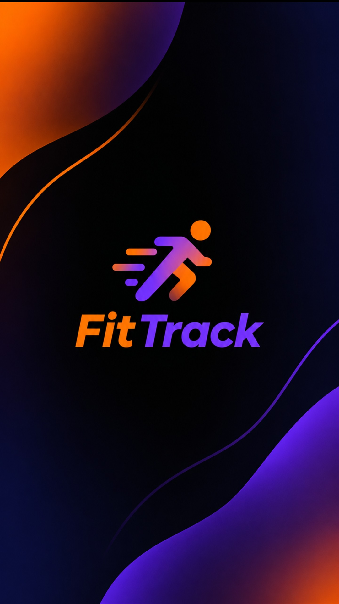

# FitTrack

<p align="center">
  
</p>

<p align="center">
  <b>Offline-fähige Trainings-App</b> – Workouts, Ernährung, Wasser, Wasserziel- & Kalorienrechner,
  Erinnerungen, Ziele, Skill-Baum und Check-in-Streak in einer schlanken Android-WebView-App.
</p>

<p align="center">
  <a href="../../actions/workflows/android.yml"></a>
  
  
  
</p>

---

## Features

| Bereich | Funktion |
|---|---|
| **Start** | Nächstes Training mit Countdown, Streak, Kalorien- & Wasser-Ring, Makros, Quick-Actions |
| **Training** | Logbuch mit Sätzen/RPE/Dauer, Pläne (Vorlagen + eigener Baukasten mit Suche & Kategorien), geteilte Pläne, Verlauf |
| **Ernährung** | Rechner mit ~70 Lebensmitteln (g/ml), Online-Suche (Open Food Facts), Foto-/Manuell-Modus, Wasser-Tracking, automatische Berechnung aus Körperdaten |
| **Erinnerungen** | Wöchentliche Trainings-Reminder inkl. echter Android-Benachrichtigungen (AlarmManager, Reboot-fest) |
| **Ziele** | Ehrlicher Foto-Check-in (Bild wird nur geprüft, nie gespeichert) + Calisthenics-Skill-Baum |
| **Profil** | Persönliche Daten, Körperbau/KFA, Tagesziel-Rechner, Theme (Dark/Light), Daten-Reset |

**Design:** kompaktes, modernes UI mit Dark- und Light-Mode, Hamburger-Navigation,
`splash.png`-Cover mit Zoom-Intro beim Kaltstart.

## Architektur

```
fittrack/
├─ fitX.js                  # App-Logik (React 18, JSX) – Single Source of Truth
├─ index.html               # Boot-Loader: lädt vendor/*, kompiliert JSX, mountet App
├─ splash.png               # Cover: Splash + adaptive App-Icon-Quelle
├─ app_icon.png             # Icon-Quelle (Quadrat)
├─ vendor/                  # React, ReactDOM, Babel, lucide-react (offline, keine CDNs)
├─ scripts/                 # sync-assets: Root → Android-Assets
├─ android/                 # Android-Projekt (Gradle, WebView-Shell, Reminder-Service)
│  └─ app/src/main/
│     ├─ assets/            # Kopie von fitX.js, index.html, splash.png, vendor/
│     ├─ java/de/fittrack/app/
│     └─ res/               # Icons, Splash-Theme, Styles
├─ docs/archive/            # historische Migrations-/Release-Notizen
└─ src/, public/, vite.config.ts   # Vorbereitung für spätere Vite/PWA-Migration
```

**Warum WebView?** Ein gemeinsamer Code-Stand für Web-Vorschau und APK, ohne Store-Abhängigkeit.
Die App arbeitet vollständig offline: `localStorage` als Datenspeicher, lokale Vendor-Bundles,
Netzwerk nur optional für die Open-Food-Facts-Suche.

## Voraussetzungen

- JDK 21 (Temurin empfohlen)
- Android SDK: `compileSdk 36`, `Build-Tools 36.1.0`, `minSdk 24`
- Optional: Android Studio

## Build & Run

```bash
cd android
echo "sdk.dir=/pfad/zum/Android/sdk" > local.properties   # nur einmal
./gradlew assembleDebug                                   # Windows: gradlew.bat
```

Die APK liegt danach in `android/app/build/outputs/apk/debug/app-debug.apk`.

Installieren:

```bash
adb install -r android/app/build/outputs/apk/debug/app-debug.apk
adb shell monkey -p de.fittrack.app -c android.intent.category.LAUNCHER 1
```

### Optional: Build-Ordner auslagern

Gegen OneDrive-/Antivirus-Locks kann der Build-Ordner aus dem Repo gelegt werden
(`%USERPROFILE%\.gradle\gradle.properties`):

```properties
fittrack.buildDir=C:/Users/<name>/.cache/fittrack-build/app
```

### Web-Vorschau ohne Android

```bash
npx serve .          # im Repo-Root, dann http://localhost:3000
```

## Datenspeicher

Alle Daten liegen lokal (`localStorage`, Prefix `fitness:`):
`reminders`, `workouts`, `meals`, `water`, `theme`, `profile`, `proposals`, `plans`,
`sharedPlans`, `nutritionProfile`, `checkins`, `skills`, `restdays`.
Kein Server, kein Konto, keine Telemetrie.

## Beitragen

Siehe [CONTRIBUTING.md](CONTRIBUTING.md): Branch-Modell, Conventional Commits,
PR-Regeln, Asset-Sync und Code-Stil.

## Lizenz

[MIT](LICENSE) © 2026 FitTrack Contributors
